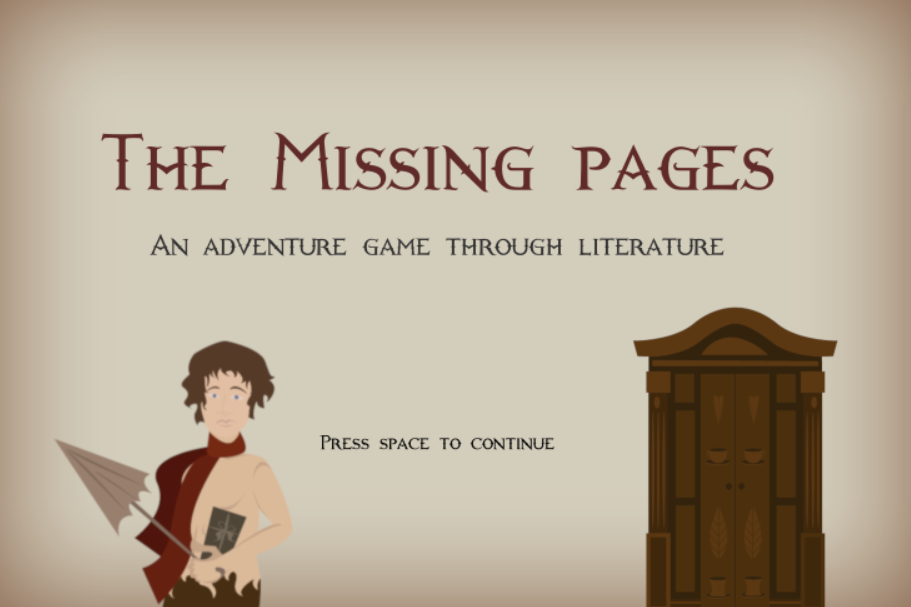
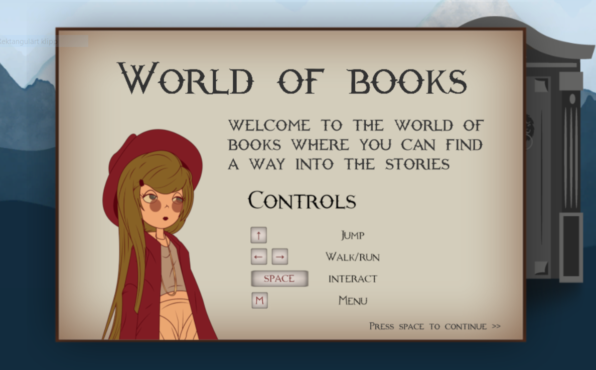
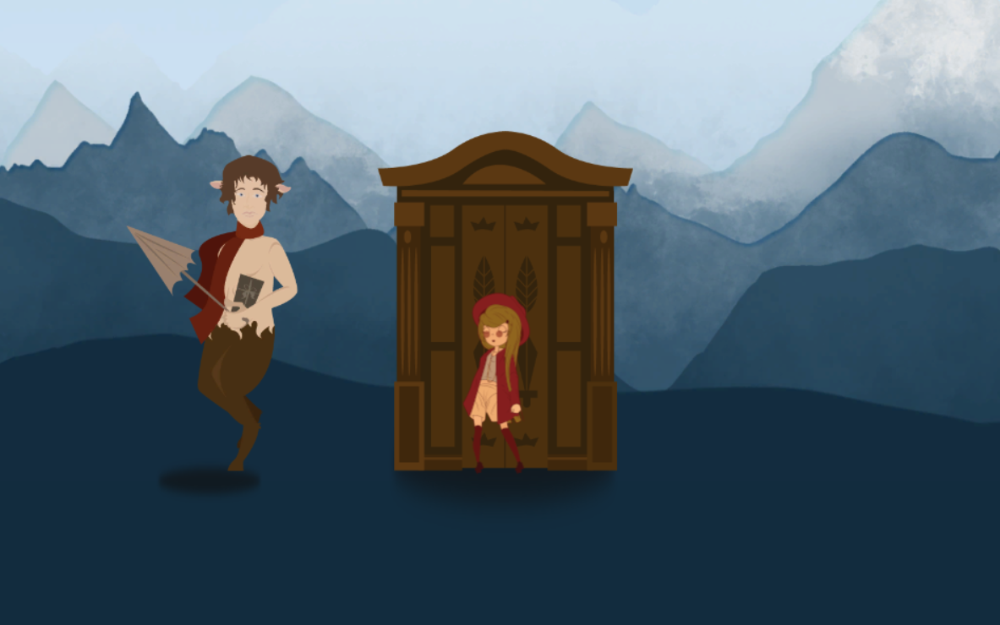
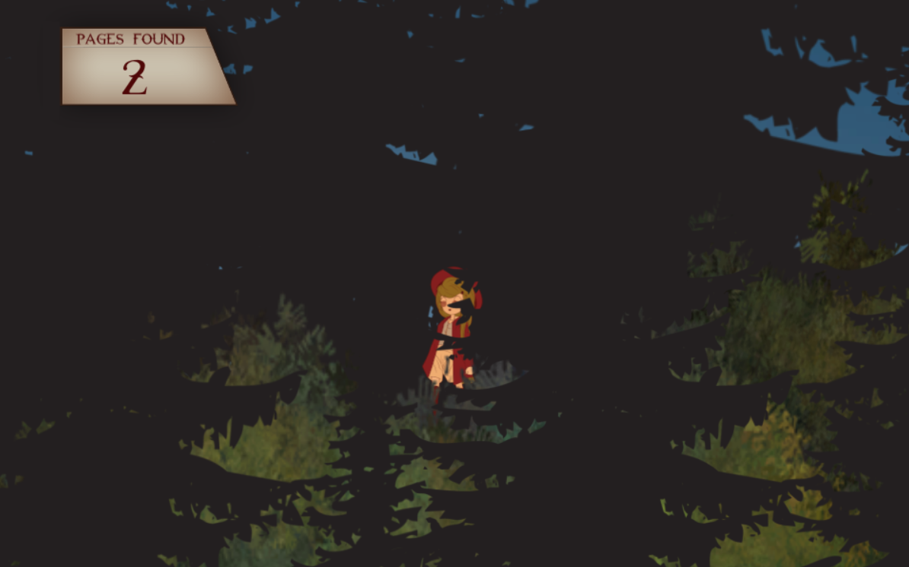
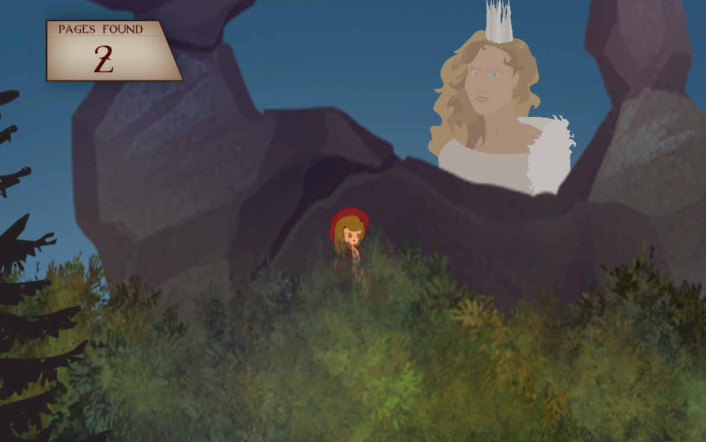

# TheMissingPages
A 2D game built in Unity during the Skyfox Game Jam 4-5/5 2019 by me (Josefine Klintberg) and Embla Westman. 
 

 
 
The Missing Pages is a storybased game that centers around the girl Fabula who lives in the world of books. She has a great library with many books but now someone has broken in and stolen some of the pages in the books. The mission of the game is to lead Fabula through doors that takes her into that specific book. There she must find the missing pages and return safely back to the World of Books. 

When a level is completed (e.g. when all the missing pages of that book has been found), the book of that specific story shows up in Fabulas library. 

So far, only the Narnia level has been implemented but the game can be built upon to create more levels. 

# Responsibilities: 
Both: Story Design
 
Josefine: Coding and Level Design
 
Embla: Sprites and Design
 
 
Some screen shots from the game can be seen below: 
 

